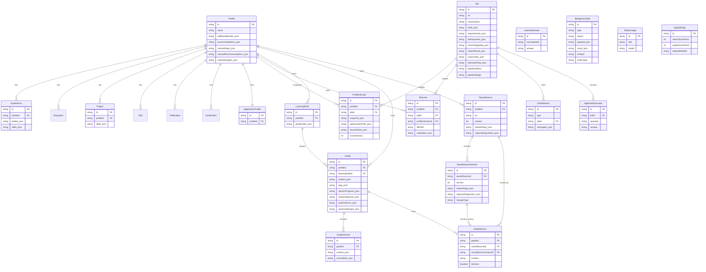

# Data Model Audit

Scope: current Prisma schema in `prisma/schema.prisma`, runtime usage in `src/app/api/**` and `src/lib/**`, and the local SQLite database at `prisma/dev.db`.

Database stack:
- ORM: Prisma
- Provider: SQLite
- Primary schema source: `prisma/schema.prisma`
- Runtime database inspected: `prisma/dev.db`

## Executive Summary

The project uses a hybrid model:
- A relational shell for top-level entities and lifecycle boundaries.
- Large JSON/text payloads embedded inside many tables for AI outputs, caches, snapshots, and ordered lists.

That approach is workable for a single-user local app, but the current implementation has four material integrity risks:
1. Re-uploading a resume deletes the entire `Profile` root and cascades most long-lived user history.
2. Learning-path membership is stored twice, and those two representations are already out of sync in the local database.
3. Job deduplication is enforced in application code rather than the schema, and the local database already contains duplicate job URLs.
4. Profile/skills chat sessions are not tied to a profile, so they can outlive profile replacement and become semantically stale.

## Current Row Counts

Snapshot from `prisma/dev.db`:

| Table | Rows |
| --- | ---: |
| Profile | 1 |
| Experience | 6 |
| Education | 2 |
| Project | 14 |
| Skill | 84 |
| Publication | 3 |
| Certification | 1 |
| Job | 369 |
| ProfileVersion | 177 |
| Resume | 166 |
| ChatSession | 32 |
| ApplicationProfile | 1 |
| ApplicationAnswer | 153 |
| LearnedAnswer | 131 |
| LearningPath | 2 |
| Guide | 12 |
| GuideVersion | 10 |
| GuideSource | 4 |
| SavedSource | 5 |
| SavedSourceVersion | 10 |
| BackgroundJob | 125 |
| TokenUsage | 1647 |
| AppSettings | 1 |

## Entity Diagram

## Domain Structure

### 1. Profile Aggregate

Relational children:
- `Experience`
- `Education`
- `Project`
- `Skill`
- `Publication`
- `Certification`
- `ApplicationProfile`

Snapshot/cached children:
- `ProfileVersion`
- `Resume`
- `LearningPath`
- `Guide`
- `SavedSource`

Embedded JSON on the root:
- `additionalEmails`
- `recommendations`
- `cachedGaps`
- `cachedRecommendations`
- `cachedInsights`

Interpretation:
- `Profile` acts as the main aggregate root for personal data, learning assets, saved articles, and generated outputs.
- The app currently assumes only one live profile exists.

### 2. Job / Optimization Aggregate

Primary entities:
- `Job`
- `ProfileVersion`
- `Resume`
- `ApplicationAnswer`
- `ChatSession` for job chats

Embedded JSON on `Job`:
- `skills`
- `requirements`
- `atsKeywords`
- `terminologyMap`
- `matchResult`
- `coverLetter`
- `interviewPrep`

Interpretation:
- `Job` is both a source record and a cache container for multiple AI-generated artifacts.
- `ProfileVersion` bridges `Profile` and `Job`; it stores full profile snapshots plus scoring metadata.

### 3. Learning Aggregate

Primary entities:
- `LearningPath`
- `Guide`
- `GuideVersion`
- `GuideSource`
- `SavedSource`
- `SavedSourceVersion`

Modeling notes:
- `LearningPath.guideOrder` stores ordering as JSON.
- `Guide.learningPathId` also stores membership relationally.
- `GuideSource` can point either to a `SavedSource` head record or a specific `SavedSourceVersion`.

Interpretation:
- The learning system uses a mix of normalized relationships and versioned content snapshots.
- Version lineage is explicit for saved sources and guides, but path membership/order is duplicated.

### 4. Operational Tables

Primary entities:
- `BackgroundJob`
- `TokenUsage`
- `AppSettings`

Interpretation:
- These are operational/system tables rather than user-content tables.
- `BackgroundJob` is generic and entity-agnostic through `entityId` and `entityType`.

## Findings

### 1. `Profile` re-upload is a destructive root delete

Severity: High

Evidence:
- `src/app/api/profile/upload/route.ts` deletes all profiles before creating a new one.
- Most long-lived tables reference `Profile` with `onDelete: Cascade`.

Why this matters:
- Replacing a resume also deletes optimization history, generated resumes, application settings, learning paths, guides, saved sources, and other profile-owned assets.
- Based on the current local DB, that means a re-upload would wipe at least:
  - 177 `ProfileVersion` rows
  - 166 `Resume` rows
  - 2 `LearningPath` rows
  - 12 `Guide` rows
  - 5 `SavedSource` rows
  - 1 `ApplicationProfile` row

Assessment:
- This is the largest data-loss risk in the current model.

### 2. Learning-path membership is duplicated and already drifting

Severity: High

Schema duplication:
- `LearningPath.guideOrder` stores guide membership and order as JSON.
- `Guide.learningPathId` stores membership relationally.

Write-path behavior:
- Some routes update `guideOrder`.
- Some routes update `learningPathId`.
- Those updates are not consistently transactional or symmetric.

Verified drift in `prisma/dev.db`:
- Learning path `Kubernetes` currently has `guideOrder = []`.
- The same path has 2 attached guides:
  - `Kubernetes Architecture & Core Concepts`
  - `Pods, Deployments & Services`

Assessment:
- The model has two competing sources of truth for the same concept.
- The API already compensates for drift by merging ordered and unordered guides at read time, which confirms this inconsistency is expected in practice rather than theoretical.

### 3. Job identity is enforced in code, not in the schema

Severity: Medium-High

Evidence:
- `Job` has no database uniqueness constraint on `url`, `canonicalUrl`, or any normalized identity key.
- Deduplication is implemented by loading existing jobs into memory and comparing normalized URLs in API handlers.

Verified duplicates in `prisma/dev.db`:
- There are currently 2 duplicated raw job URLs.
- Example duplicates:
  - `https://www.amazon.jobs/en-gb/jobs/3203558/software-development-engineer-ai-prime-video-personalization-and-discovery-science`
  - `https://www.amazon.jobs/en-gb/jobs/3206040/sde-ii-healthcare-ai`

Assessment:
- Concurrent imports or code paths that skip the dedupe logic can create duplicates.
- The local database already shows the schema is not protecting this invariant.

### 4. Profile and skills chat sessions are not tied to a profile

Severity: Medium

Evidence:
- `ChatSession` only has an optional `jobId`; it has no `profileId`.
- `/api/chats` lists sessions globally by `type` and optional `jobId`.
- `profile` upload deletes the profile root, but profile/skills chats are not cascade-linked to that profile.

Why this matters:
- A profile or skills chat can survive after the underlying profile is replaced.
- The preserved chat history can then be reopened against a different profile than the one it originally discussed.

Assessment:
- This is a semantic integrity problem rather than a foreign-key error, but it will surface as stale or misleading chat context over time.

## Architectural Notes

### Relational core with JSON-heavy payloads

This schema is not purely normalized. Many important business concepts live in stringified JSON fields:
- AI outputs: `Job.matchResult`, `Job.coverLetter`, `Job.interviewPrep`
- Snapshots: `ProfileVersion.snapshot`, `ProfileVersion.resumeData`
- Workflow state: `Guide.content`, `Guide.sectionStatuses`, `BackgroundJob.payload`
- Ordering/state caches: `LearningPath.guideOrder`, `Profile.cached*`

This is reasonable for AI-generated content, but it means:
- Prisma cannot enforce the inner shape of those documents.
- Partial updates are harder.
- Cross-record analytics and querying are limited.

### Strong singleton assumption

The model looks multi-entity at the table level, but the application behavior is singleton-oriented:
- `profile.findFirst()` appears across the app.
- profile upload deletes every profile row.

That assumption should either be codified explicitly or removed. Right now it is implicit.

## Recommended Refactor Direction

1. Make the singleton profile explicit, or support multi-profile cleanly.
   - If singleton: use a fixed profile row and update it in place.
   - If multi-profile: add `profileId` ownership everywhere it matters, especially `ChatSession`.

2. Remove the dual source of truth for learning-path membership.
   - Best option: add a join table such as `LearningPathGuide(pathId, guideId, position)`.
   - Minimum option: keep `Guide.learningPathId` as truth and derive ordering separately.

3. Enforce job identity in the database.
   - Add a normalized unique key for job URLs.
   - Consider a separate `JobImport` or `JobIdentity` table if canonicalization is complex.

4. Keep expensive/generated artifacts, but reduce schema ambiguity.
   - JSON snapshots are fine for AI outputs.
   - Do not use JSON blobs for relationships, membership, or ordering when those concepts need integrity guarantees.

## Files Reviewed

Primary sources:
- `prisma/schema.prisma`
- `src/app/api/profile/upload/route.ts`
- `src/app/api/learn/paths/route.ts`
- `src/app/api/learn/paths/[id]/route.ts`
- `src/app/api/learn/paths/[id]/generate/route.ts`
- `src/lib/worker/handlers.ts`
- `src/app/api/jobs/route.ts`
- `src/app/api/jobs/batch/route.ts`
- `src/app/api/jobs/scan-emails/route.ts`
- `src/app/api/chats/route.ts`
- `src/app/api/chats/[id]/route.ts`

